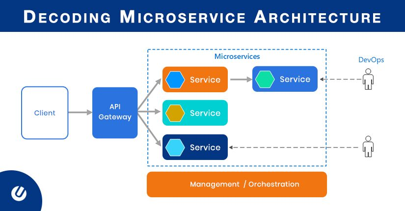
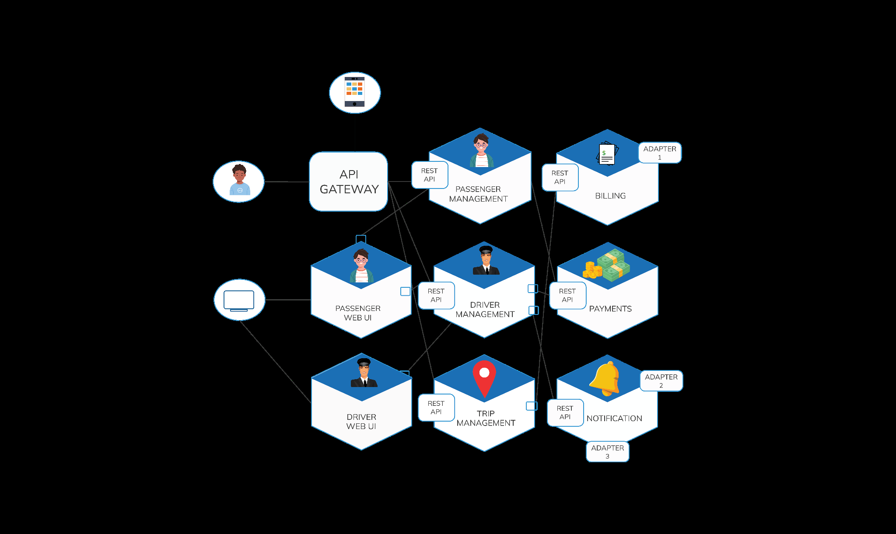

# Microservices Architecture

## Introduction

We have two Architectural Patterns that can be applied to our application. Monolithic is one kind of architecture pattern while Microservice is another kind of architecture pattern. Both these patterns have their own advantages and disadvantages, their usage depends on the use case. Like if we are developing a new application completely then we can start with Monolithic Architecture and then slowly we can progress to Microservice architecture.

## What is Microservice Architecture?

A microservice architecture consists of small, independent, and loosely coupled services. Each service is independent i.e. each service has its separate codebase and can be deployed independently. Each service is responsible for a single business responsibility within a bounded context.

**Example of Microservice Architecture in Cab Booking application:**

Let’s imagine that you are building a Cab Booking application like Ola that plans the trip requested by the passengers, provides them a driver, accepts payments from passengers and sends them notifications. This application will consist of several components including the Passenger Management, Driver Management, Trip Management, Payments, Billing, and Notification services. These services will communicate with each other using API Gateways and will collectively serve the purpose of Cab Service.

## Advantages of Microservice Architecture

- **Selective Scaling:** You can scale out subsystems that need additional resources without scaling out the entire application because services can be scaled independently.

- **Loose Coupling:** Bug fixes and feature releases are simpler to handle because microservices are distributed independently.

- **Multiple Tech Stack:** A team can pick the technology that best fits their service, therefore resulting in a use of a mix of technology stacks for different services.

- **Fault Isolation:** If there are any upstream microservices to properly handle failures, a particular microservice going faulty won't affect the entire application.

## Disadvantages of Microservice Architecture

- **Network congestion and latency:** The use of many small, granular services can result in more interservice communication, which results in higher latency.

- **Security:** The frequent deployment of microservices across many cloud environments increases risk and reduces control and visibility over application components.

- **Testing:** The testing phase is complex for microservices-based applications because Integrated testing is difficult when there are only separate microservice teams.

- **Costly:** The total system has more moving components because of the microservices architecture, and this adds cost. Only if the expense of fully adopting microservices can be amortized across dozens of development teams, it will be worthwhile.

## Monolithic Vs Microservice Architecture

| Aspect                           | Monolithic Architecture                  | Microservices Architecture                |
|----------------------------------|-----------------------------------------|-----------------------------------------|
| Codebase Structure               | Consists of a single codebase with multiple modules within it, according to the business functionalities. | Consists of individual services with each service being responsible for exactly one functionality. |
| Development Complexity           | Do not need expert domain knowledge for development. | Risky to implement without domain expertise and container knowledge. |
| Deployment                       | Easier deployment.                      | Relatively complex deployment.          |
| System Updates                   | Updating the system is a tedious process which would need the entire system to be redeployed. | Only the service which is updated needs to be redeployed. |
| Reusability                      | Reusing the modules from one software into other software systems is difficult. | Microservices can be easily used in development of other software. |

