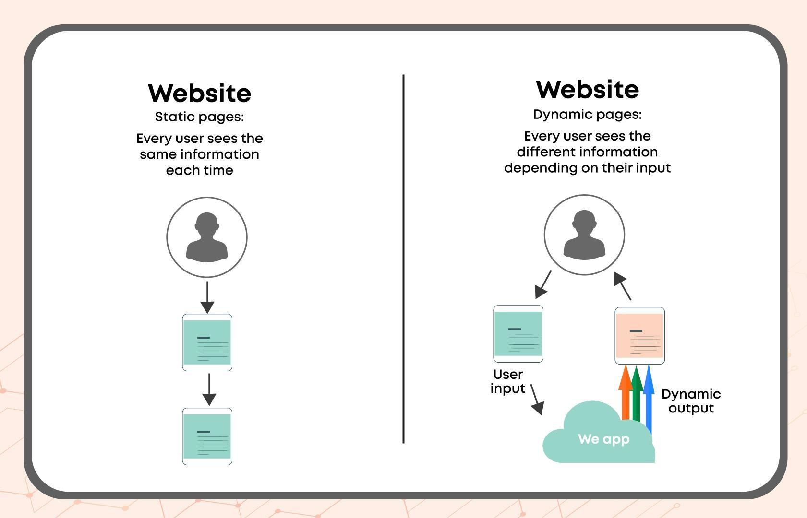
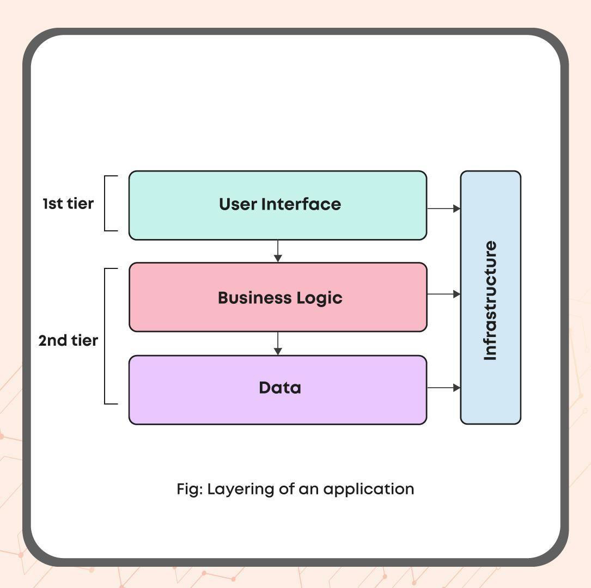

# Monolithic Architecture

## Websites Vs Web Applications

A website is a group of interlinked web pages that provides textual or visual data that can just be read. Websites are platforms that help users navigate and extract the required information.

In contrast, a Web Application provides dynamic data that can be read and written/manipulated on the web page. Web Applications run on a web server. In short, Web Applications = Website + Additional Functionalities + Interactive Elements.

**Example:**

- Website: codingninjas.com, google.com
- Web Applications: YouTube, Twitter, Google apps

## What is Monolithic Architecture?

The dictionary meaning of monolithic is “formed of a single large block”. Monolithic architecture defines the unified model in which the complete application is deployed as a single unit/system in system design.

In other words, if all the components and functionalities of a project are entangled and combined in a single codebase, then that is a monolithic application. Monolithic Architecture has less complexity => Easier to understand => Higher productivity.

The web applications have different layers as follows:

1. **User Interface (Front-End):** The user interface can be a webpage or a desktop application. It is the closest layer to the target user using which the user can get things done. It takes the user’s request, interacts with the server, and displays the user’s result.

2. **Business logic (Domain/Back-End):** It comprises all the logic behind the application. The application server includes the business logic, receives requests from the native client, acts on them, and persists the data to storage.

3. **Data Interface:** It includes the data persistence mechanism (DB) or communication with other applications. It comprises the DataBase, message queues, etc. A database server that would be used by the application server for the persistence of data.

**Example:**

Suppose we want to create a monolithic architecture for a medical system. The system’s main components would be patients, doctors, wards, appointments, and the hospital unit. And the logical relationship would be that doctors give appointments to patients, and they visit the ward if required where the doctor treats the patient in the hospital.

The application would have a Frontend where the appointments would be booked or doctor’s availability would be checked, and a backend where the user’s requests would be entertained and dynamic results provided.

## Benefits of Monolithic Architecture

1. **Easy development:** Monolithic architecture is the traditional model for design and therefore doesn’t require many skilled developers due to less complexity.

2. **Easy deployment:** Since all the components are stored in a single repository, it is easy to handle, and only one directory has to be cared about.

3. **Easy testing:** The model is closely encapsulated. Therefore testing is end to end and faster.

4. **Less cross-cutting problems:** Cross-cutting issues are the ones that affect the whole of the system, like caching, logging, and handling. Lesser issues because the single unit can be better handled.

## Disadvantages of Monolithic Architecture

1. **Difficult to understand:** because all the code is stored in a single directory.

2. **Challenging to introduce a change or replace a framework:** since every element is tightly encapsulated.

3. **Making any changes would be possible only by redeployment:** of the complete software application.

4. **Less scalable:** because each element has different scalability requirements.

5. **Less reusability.**
